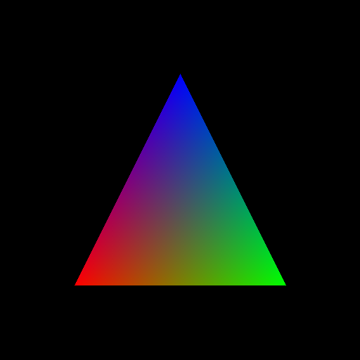
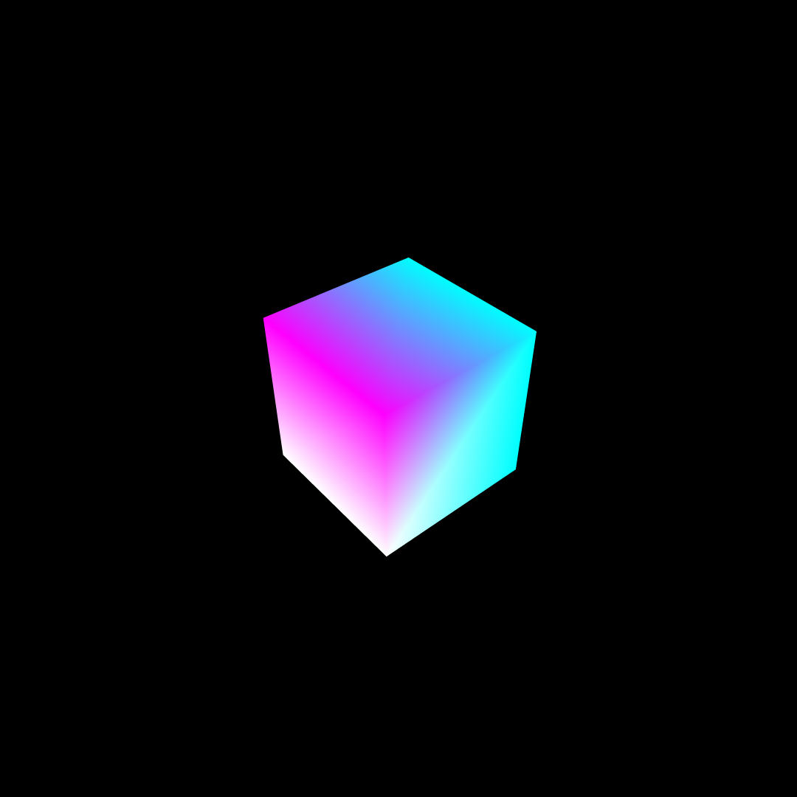
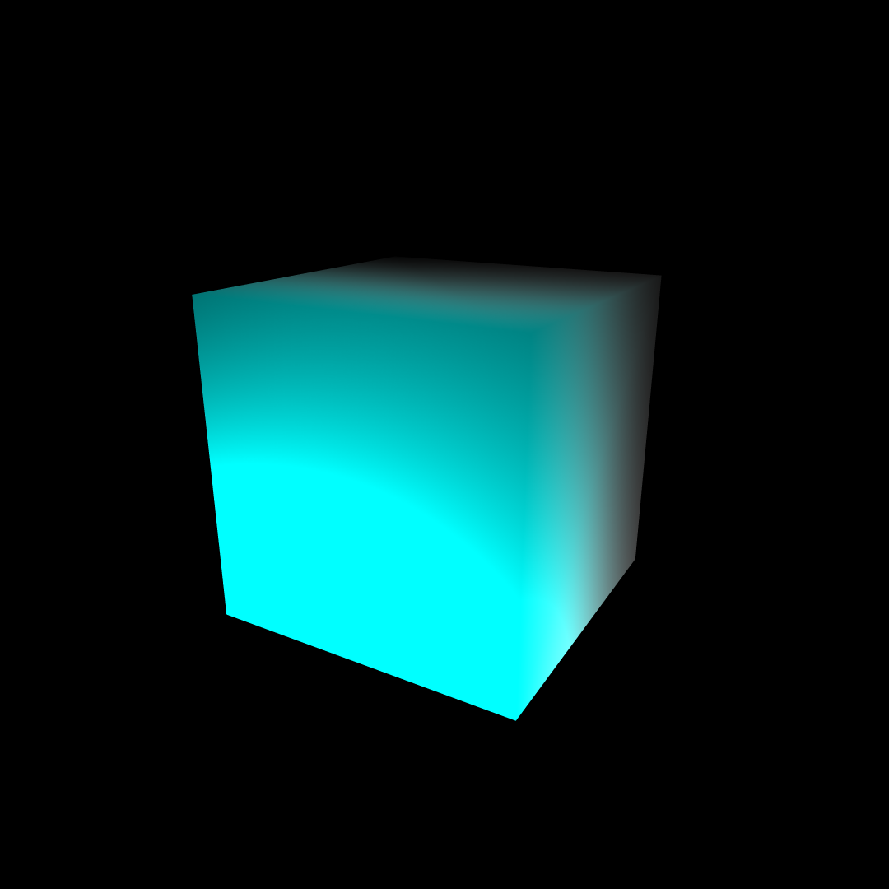
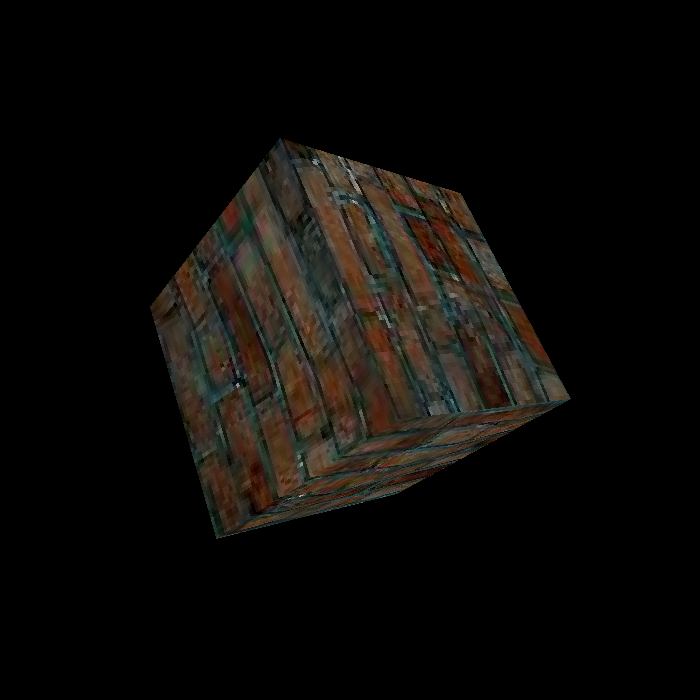

# BMP光栅化渲染器

# 前言

本项目是本人学习games101课程后，为了更深入了解渲染器而制作的一个非常简单的光栅化渲染器。笔记见docs[目录](https://github.com/Yang-Junjie/Bmp-Rasterization-Renderer/tree/master/docs/LearnCG)

# 功能

- 简单的线性运算，支持矩阵与向量，矩阵与矩阵，向量与向量之间的的加、减、乘除、数乘运算。
- 模型变换，视角变换，投影变换
- 光栅化三角形
- 通过顶点和顶点索引光栅化其他模型
- 重心坐标插值
- Blinn-Phong Shading
- MSAA抗锯齿
- Z-Buffer深度缓冲

# 构建

在项目根目录执行以下命令

```shell
$ cd build
$ cmake ..
$ cmake --build .
$ ./bmp.exe
```

将会生成output.bmp结果图像

# 演示

重心坐标插值后的三角形



变换后的立方体



blinn-phong光照下的立方体



Texture



# **技术栈总结**

- **语言特性**：面向对象、STL容器/算法、内存管理、操作符重载（如向量运算），现代C++特性。
- **图形学技术**：光栅化、深度测试、抗锯齿、Phong着色、矩阵变换、纹理贴图。
- **性能关键**：包围盒优化、多级采样、插值计算。
- **文件格式**：BMP文件头的低层写入与对齐。